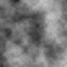
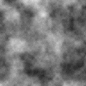

# Лабораторная работа 01 — вариант 13

**Подготовка рабочей среды и паспорт воспроизводимого AI-эксперимента**

Рясной Владимир Олегович, группа МИК11, направление 09.04.02,
программа «Интеллектуальные медиатехнологии».
Дисциплина по методическим указаниям — «Искусственный интеллект в креативных технологиях».
Преподаватель — Трубчик Ирина Степановна.

Исследуется учебный генератор процедурных текстур. Для варианта 13 контекст —
мраморный узор для обложки; единственный изменяемый фактор — увеличение размера
изображения с 96 × 96 до 144 × 144 пикселей. Основной эксперимент выполнен
24 сентября 2026 года при `seed = 101`, `n = 5`.

## Для проверки преподавателем

1. [Отчёт с титульным листом](ЛР01/reports/Рясной_Вариант_13_Лаб1.docx).
2. [Паспорт эксперимента](ЛР01/artifacts/v13/passport.md) и
   [полные результаты JSON](ЛР01/artifacts/v13/results.json).
3. [Журнал с предварительной гипотезой](ЛР01/experiment_journal_v13.md).
4. [Порядок проверки и соответствие заданию](docs/REVIEW.md).
5. [Проверка рабочей среды Engee](ЛР01/artifacts/engee/passport.md) и
   [выполненный скрипт](ЛР01/reports/LR01_environment.ngscript).

Автоматическая проверка из корня репозитория:

```bash
python tools/verify_submission.py
```

Команда проверяет комплект по SHA-256, сопоставляет паспорт и результаты,
проверяет сохранённые PNG, экспорт Engee и повторяет серии `n = 5` и `n = 50`
во временной папке.
Для короткой проверки только обязательной серии используйте `--quick`.
Сохранённые результаты и журнал не перезаписываются.

## Результат

Протокол по полным массивам пикселей выполнен:
`EQ_1_2 = true`, `EQ_1_4 = true`, `EQ_1_3 = false`, `EQ_2_4 = true`.

| Метрика | Среднее базы | s базы | Среднее фактора | Δ | Абс. Δ / s базы |
|---|---:|---:|---:|---:|---:|
| Средняя яркость | 0.4943 | 0.0134 | 0.5038 | +0.0095 | 0.71 |
| Контраст | 0.1162 | 0.0102 | 0.1181 | +0.0019 | 0.18 |
| Граничная энергия | 0.0198 | 0.0005 | 0.0199 | +0.0001 | 0.26 |
| Энтропия | 6.8756 | 0.1224 | 6.9343 | +0.0586 | 0.48 |

По заранее заданному учебному правилу `abs(Δ) > 2 * s_base` изменения
не обнаружены для всех четырёх метрик при `n = 5`. Это не доказательство
отсутствия эффекта и не формальный статистический тест. Дополнительная серия
`n = 50` приведена отдельно и не меняет исходный критерий.

| База 96 × 96 | Фактор 144 × 144 |
|:---:|:---:|
|  |  |

Изображения показаны с одинаковым физическим размером для сравнения.

## Структура

```text
.
├── README.md                         # входная точка для проверки
├── MANIFEST.sha256                   # контрольные суммы комплекта
├── requirements-report.txt          # только для сборки черновика Word
├── docs/
│   ├── REVIEW.md                     # карта задания и порядок проверки
│   ├── ЛР01_..._МУ.docx              # исходные методические указания
│   └── teacher_examples/             # исходное демо преподавателя, вариант 1
├── tools/
│   ├── verify_submission.py          # проверка и повторный расчёт
│   ├── build_report_v13.py           # сборка отдельного черновика отчёта
│   └── package_submission.py         # подготовка ZIP и манифеста
└── ЛР01/
    ├── src/                          # неизменённые учебные скрипты
    ├── variants_lr01.json            # исходные 30 вариантов
    ├── requirements.txt              # пустой: опыт без внешних зависимостей
    ├── experiment_journal_v13.md      # журнал собственного эксперимента
    ├── artifacts/
    │   ├── v13/                      # обязательная серия n = 5
    │   ├── v13_n50/                  # дополнительная серия n = 50
    │   ├── engee/                    # паспорт и вывод проверки части Б
    │   └── error_demo_v13/           # диагностика отсутствующего seed
    └── reports/
        ├── Рясной_Вариант_13_Лаб1.docx
        ├── LR01_environment.ngscript
        └── assets/dgtu-logo.png
```

## Подготовка Python

Для расчётов достаточно Python **3.10+** и стандартной библиотеки.
Исходная среда: CPython 3.12.8, macOS arm64, zlib 1.2.11.
При проверке другой среды сравнивайте массивы пикселей и метрики; байты PNG
могут зависеть от версии zlib. Дата и описание ОС нового запуска также отличаются.

macOS / Linux, из корня репозитория:

```bash
python3 -m venv .venv
source .venv/bin/activate
python --version
python -m pip install -r ЛР01/requirements.txt
python tools/verify_submission.py
```

Windows PowerShell, без активации среды:

```powershell
py -3 -m venv .venv
.\.venv\Scripts\python.exe --version
.\.venv\Scripts\python.exe -m pip install -r .\ЛР01\requirements.txt
.\.venv\Scripts\python.exe .\tools\verify_submission.py
```

Пустой `requirements.txt` относится к эксперименту. Для чтения результатов
и автоматической проверки устанавливать `python-docx` не нужно.
Проверка также сверяет код и сохранённые результаты экспорта Engee с журналом
`versioninfo.log`; удалённое ядро Julia автоматически не запускается.

## Новый запуск вручную

Выполняйте из корня репозитория. Новые результаты записываются в `.runs/`:

```bash
python ЛР01/src/lab01_experiment.py --variant 13 --seed 101 --n 5 --out .runs/v13
python ЛР01/src/lab01_experiment.py --variant 13 --seed 101 --n 50 --out .runs/v13_n50
```

Повтор диагностики seed:

```bash
python ЛР01/src/lab01_generator.py --out .runs/noseed_run1
python ЛР01/src/lab01_generator.py --out .runs/noseed_run2
python ЛР01/src/lab01_generator.py --seed 101 --out .runs/seed101_run1
python ЛР01/src/lab01_generator.py --seed 101 --out .runs/seed101_run2
```

Запуски без seed намеренно показывают ошибку воспроизводимости.
Их новые значения seed не должны совпадать с историческим журналом.
Учебный CLI рассчитан на варианты **1–30** и `n >= 2`.

## Engee

Часть Б выполнена **1 октября 2026 года** через браузер с кампусной лицензией
ДГТУ. Версии: кабинет `26.9.1.1`, среда `26.9.2-H1`, Julia `1.12.4`.
Созданы папки `/user/AI_creative_technologies/LR01/`, скрипт сохранён,
команды `VERSION` и `versioninfo()` выполнены, проверены переменная `seed`,
очистка переменных и перезапуск ядра.

После очистки `seed` исчезает из таблицы, но привязка имени остаётся со значением
`EngeeNothing()`. После перезапуска `isdefined(Main, :seed)` возвращает `false`.
Подробности: [дополнение к паспорту](ЛР01/artifacts/engee/passport.md),
[полный вывод versioninfo](ЛР01/artifacts/engee/versioninfo.log) и
[проверки состояния](ЛР01/artifacts/engee/state_checks.log).
[Скрипт Engee](ЛР01/reports/LR01_environment.ngscript) — экспортированный
интерактивный документ с сохранёнными результатами, а не обычный текст Julia.

Ошибки HTTP 502/400/418 от 24 сентября сохранены в журнале как история первой
попытки; они не описывают текущий статус. Python-паспорт остаётся историческим,
сведения Engee оформлены отдельным дополнением. Учётные данные и персональный
адрес среды не включены в комплект.

## Отчёт и архив

Сдаваемый Word-файл содержит ручную редакцию студента. Для отдельного черновика:

```bash
python -m pip install -r requirements-report.txt
python tools/build_report_v13.py
```

Черновик появится в `.runs/report_v13.docx`. Сборщик использует сохранённые
результаты и локальную эмблему; доступа к рабочему столу автора не требует.
Он не перезаписывает сдаваемый отчёт. Перед заменой отчёта проверьте новый
документ визуально в Word или LibreOffice.

Архив для передачи преподавателю:

```bash
python tools/package_submission.py
```

Он записывается в `dist/lab01_variant13_submission.zip`. Для обновления
контрольных сумм после осознанных правок:

```bash
python tools/package_submission.py --update-manifest
python tools/verify_submission.py
```

## Получение проекта

```bash
git clone https://github.com/riasnoi/creative-ai-labs.git
cd creative-ai-labs
python3 tools/verify_submission.py
```

В Windows вместо `python3` можно использовать `py -3`.

Корень этого каталога — корень репозитория. В Git включаются исходники,
документация, сдаваемый отчёт и небольшие PNG/JSON результаты.
`.venv`, кеши, временные файлы Word, повторные запуски, локальные резервные
копии и ZIP исключены через `.gitignore`.

## Происхождение материалов

Учебные `lab01_generator.py`, `lab01_experiment.py`, список вариантов,
методические указания и демонстрационные журналы получены с заданием.
Их исходные расчётные скрипты сохранены побайтно, чтобы соответствовать
SHA-256 в паспорте. Журнал варианта 13, результаты, отчёт и вспомогательные
скрипты составляют выполненную работу. Внешнего набора данных нет.
