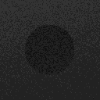
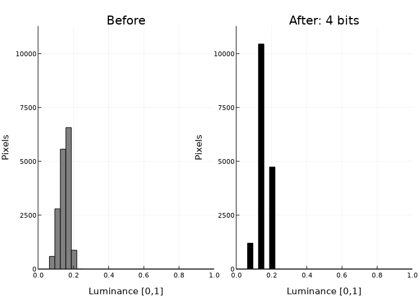

# ЛР03 — Подготовка изображений и визуализация в Engee

**Вариант 13:** тёмная синтетическая сцена, квантование яркости до 4 бит.
Рясной Владимир Олегович, МИК11. Опыт выполнен 7 октября 2026 года
в Engee 26.9.2-H4, Julia 1.12.4; кабинет 26.10.1.

[Word](reports/Рясной_Вариант_13_Лаб03.docx) ·
[PDF](reports/Рясной_Вариант_13_Лаб03.pdf) ·
[Архив артефактов](artifacts/LR03_13_artifacts.zip) ·
[Паспорт](artifacts/passport.md) ·
[Выполненный блокнот](src/LR03_13.ngscript)

Гипотеза и критерии зарегистрированы до расчёта. Серия: seed 101–105,
128 × 128, lo 0.02, hi 0.30, noise 0.02, 32 интервала гистограммы.

| Метрика | База | После | Δ | Абс. Δ / s | Изменение, % | Допуск 5% |
|---|---:|---:|---:|---:|---:|---|
| Средняя яркость | 0.149007 | 0.147981 | −0.001026 | 12.401 | 0.688 | Не превышен |
| Контраст | 0.028001 | 0.037672 | +0.009671 | 70.970 | 34.538 | Превышен |
| Энтропия, бит | 1.903012 | 1.214956 | −0.688056 | 92.039 | 36.156 | Превышен |

Все метрики проходят учебное правило `abs(Δ) > 2s`; оно не является формальным
статистическим тестом. Средний PSNR **33.324636 дБ** выше заранее выбранного
порога 30 дБ. На seed 101 остаются три уровня яркости, поэтому плавные переходы
теряются при небольшом изменении средней яркости.

| До | После 4 бит |
|:---:|:---:|
|  |  |



## Проверка

Из папки `lab_03`, Python 3.11+ и NumPy:

```bash
python3 -m pip install -r requirements.txt
python3 tools/verify_submission.py
```

Проверяются точные Float64 из Engee: десять массивов, квантование, метрики
пяти seed, выборочные стандартные отклонения, MSE, средний PSNR, гистограммы
и SHA-256. Это независимая проверка сохранённых первичных данных, а не удалённый
повтор ядра. [Результат проверки](artifacts/independent_verification.json).

## Новый расчёт

Julia 1.12.4; пакеты Images 0.26.2 и Plots 1.41.6:

```bash
julia -e 'using Pkg; Pkg.add(PackageSpec(name="Images",version="0.26.2")); Pkg.add(PackageSpec(name="Plots",version="1.41.6"))'
julia src/LR03_13.jl /tmp/LR03_repeat/artifacts
python3 tools/verify_results.py /tmp/LR03_repeat/artifacts
```

На Windows укажите новый доступный каталог вместо `/tmp/LR03_repeat/artifacts`.
Сценарий защищает существующие результаты от перезаписи. В Engee можно загрузить
[src/LR03_13.ngscript](src/LR03_13.ngscript), изменить каталог вывода в последней
ячейке на новый и выполнить весь скрипт. В первой ячейке находится точная копия
учебной библиотеки. Сохранённые выводы показывают исторический запуск; актуальное
состояние ядра подтверждается новым выполнением.

Сценарий создаёт `LR03_13_export.toml` рядом с каталогом результатов. Для переноса
через интерфейс Engee скачайте этот файл и распакуйте в пустую папку:

```bash
python3 tools/unpack_export.py LR03_13_export.toml new_results
```

Оригинальный переносимый `.jl` реально выполнен как кодовая ячейка Engee.
Локальный запуск Julia на другой ОС отдельно не проверялся. Вся серия и
дополнительное демо варианта 1 успешно выполнены в Engee.

## Состав и происхождение

- `src/original/lab03_lib.jl` — неизменённый код преподавателя, 5027 байт.
- `docs/` — методические указания, варианты, исходный демо-журнал,
  [карта требований](docs/REVIEW.md) и [проверки](docs/VERIFICATION.md).
- `artifacts/engee/` — 19 первичных файлов: полные значения, логи, PNG,
  CSV и десять массивов `.f64` (little-endian, column-major).
- `artifacts/` — предварительные критерии, паспорт, происхождение,
  независимая проверка и архив.
- `reports/` — финальный редактируемый DOCX и экспортированный из него PDF.
- [Журнал](experiment_journal.md) — регистрация и фактические действия.
- `MANIFEST.sha256` — хеши всех файлов работы, кроме самого манифеста.

Хеш массива яркости seed 101 повторён независимо:
`9db03f25cac20f04afd23bbf013464a28dce9ebe6cb893f0d16aa949ccc52436`.
PNG кодируется в 8 бит для просмотра; метрики вычислены по исходным Float64.
Версия кабинета установлена отдельным наблюдением после расчёта;
историческое поле `cabinet` в первичном `results.toml` сохранено без правок.
